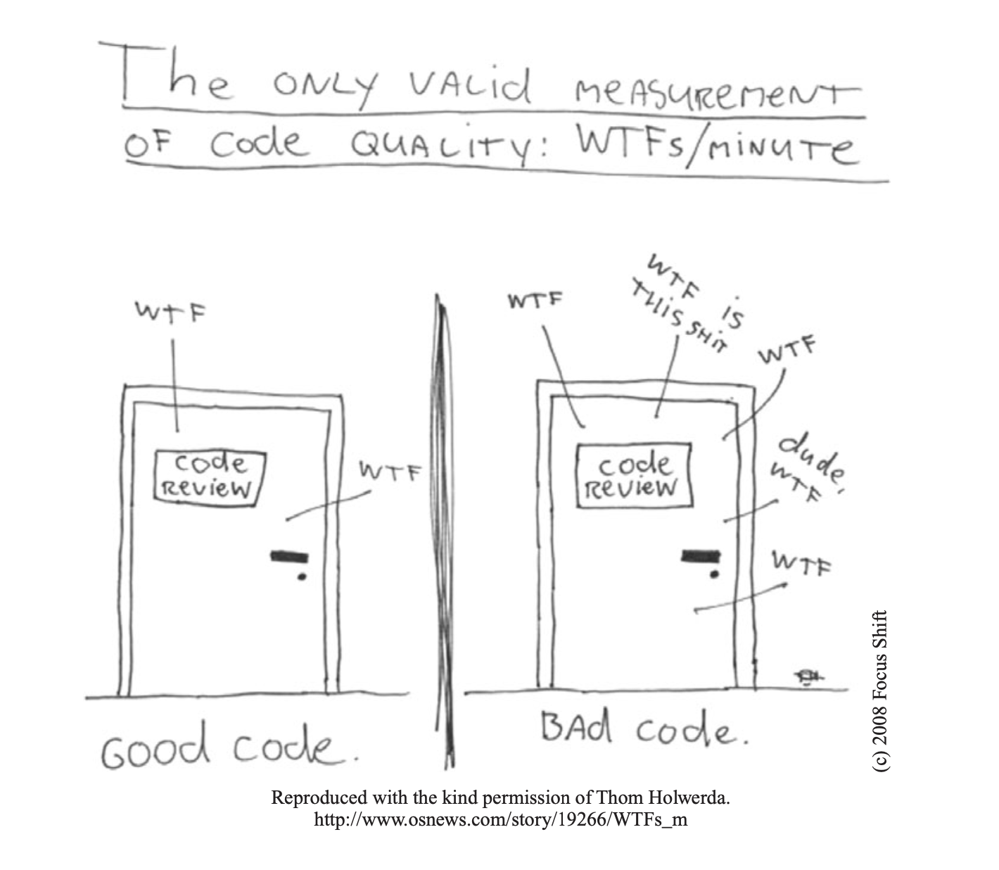
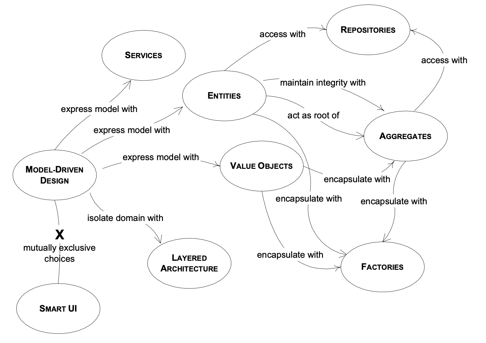
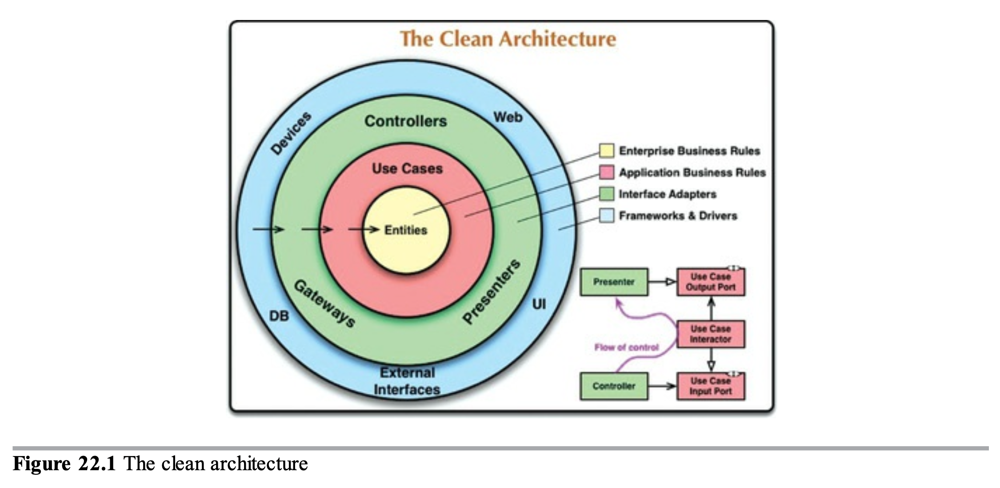
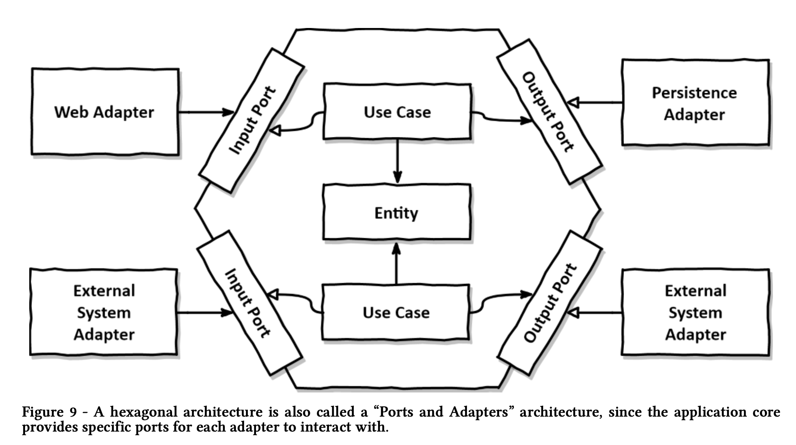
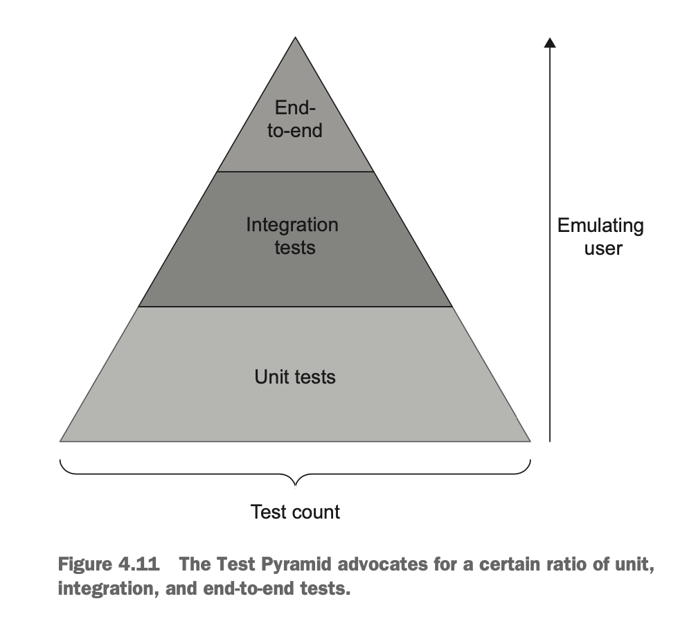
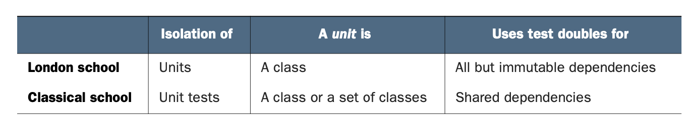
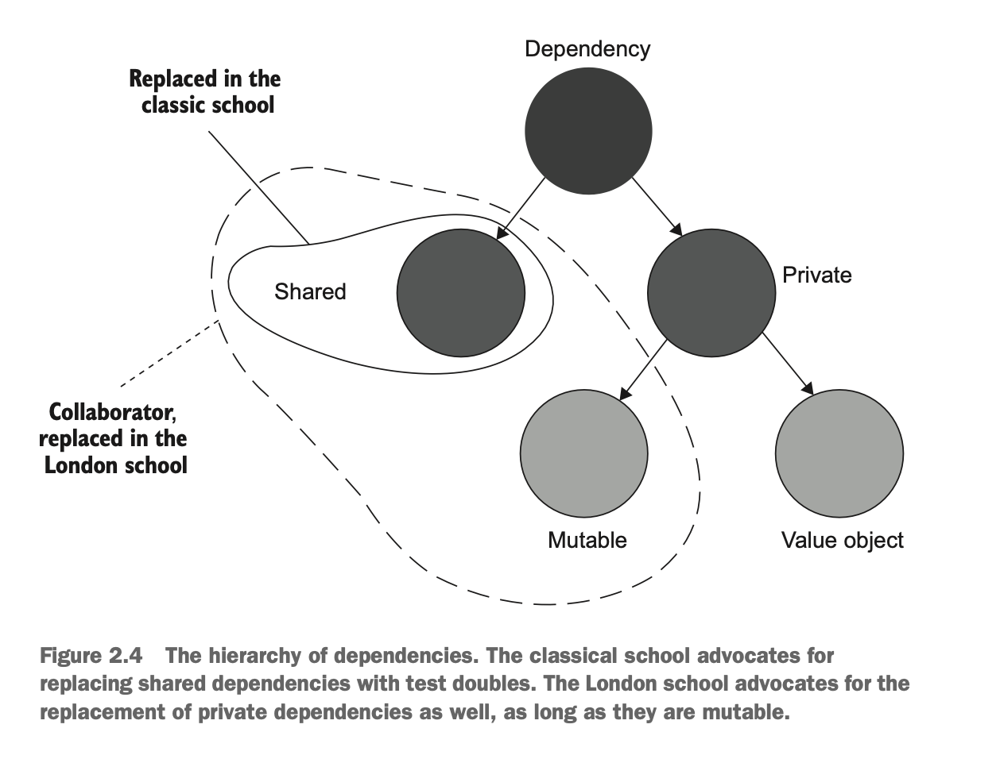
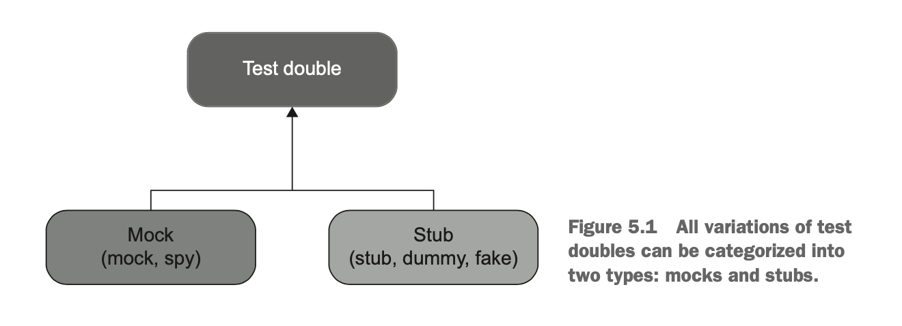
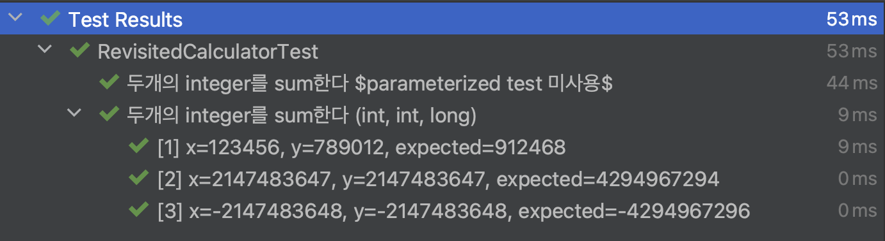
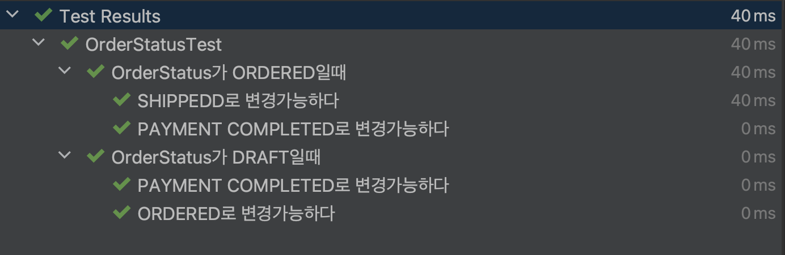

# 스프링 테스팅

## 교육대상
- 단위/통합 테스팅을 입문하고자 하는 분
- 테스트를 작성하고 있지만, 좀 더 좋은 테스팅에 대해 고민하시는 분
- 참고
  - 코드는 제공되지만, 따라해보는 실습은 없습니다.
  - TDD는 다루지 않습니다.

## 교육목표
- 테스팅에 대해 이해합니다.
- Spring Boot, JPA, JUnit5 를 이용하여 단위/통합 테스트를 작성해 봅니다.
- 실용적이고, 효율적인 테스팅 방법에 대해 고민합니다.
- 아래의 책들에 기반한 내용이 주를 이룹니다.
  - Unit Testing (Vladimir Khorikov, Manning, 2020)
  - Pragmatic Unit Testing in Java 8 With JUnit (Jeff Langr with Andy Hunt & Dave Thomas, The Pragmatic Programmers, 2015)
- https://github.com/letsfunky/testing-guide

# 시작하기 전에
## 약력
  - 잡다구리한 도메인에서 잡다구리한 테스트를 해봄
    ```
    한국투자증권 (pro*c, manual testing)
    daum/kakao (spring, junit, selenium, acceptance test)
    myrealtrip (rails, rspec)
    sk telecom (spring, junit, rest-assured, end-to-end test)
    kakao (spring, rails, junit, rspec)
    ncsoft (spring, junit, grpc, concurrency test)
    bemyfriends (spring, kotest, 99.99% integration test)
    nhn cloud (spring, junit, concurrency test)
    ```

# 0 Software Engineering
## 0.1 정답은 없고, 정답에 가까운 길을 찾아갈 뿐
<br/>

## 0.2 Good code vs Bad code
```
Any fool can write code that a computer can understand. 
Good programmers write code that humans can understand.

- Martin Fowler
```
<br/>

## 0.3 Let's speak the same language (Ubiquitous Language)
<br/>
- consensus + convention

## 0.4 테스트 해야하나요?
```
Tip 66: Testing Is Not About Finding Bugs
Tip 67: A Test Is the First User of Your Code
Tip 70: Test Your Software, or Your Users Will

- Test To Code (David Thomas and Andrew Hunt, The Pragmatic Programmer, 2020)
```

# 1 테스팅이란 무엇일까요?
## 1.0 테스팅이란 무엇일까요?
```
Testing was always a poor name for this particular programming activity.

The very name makes it sound like it’s something 
- separate from coding, 
- separate from design, 
- and separate from debugging.

It's not.

- Foreword (Jeff Langr with Andy Hunt & Dave Thomas, Pragmatic Unit Testing in Java 8 With JUnit, 2015)
```

## 1.1 우리는 언제 테스트를 할까요?
- You just finished coding a feature and want to ensure that it works as you expect.
- You want to document a change so that you and others later understand the choices you coded into the system.
- You need to change code and want to make sure your forthcoming changes don’t break any existing behavior.
- You want to understand the current behavior of the system.
- You want to know when third-party code no longer behaves as you expect.

## 1.2 그럼 테스팅의 목표는 무엇일까요?
- The goal is to enable sustainable growth of the software project. 
- (side effect) unit testing practices lead to a better design.

## 1.3 그런데 코드에는 부채와 비용이 존재합니다
### 1.3.1 Code (Asset vs Liability)
  - The larger the code base, the more exposure it has to potential bugs
### 1.3.2 Test Costs
  - Refactoring the test when you refactor the underlying code
  - Running the test on each code change
  - Dealing with false alarms raised by the test
  - Spending time reading the test when you’re trying to understand how the underlying code behaves

## 1.4 그럼 무엇을 테스트 해야 좋을까요?
- 뭘 하면 잘 했다고 소문이 날까

## 1.4.1 100% Coverage
```
How much of the code should be tested with these automated unit tests? 
Do I really need to answer that question? All of it! All. Of. It.

Am I suggesting 100% test coverage? No, I’m not suggesting it. I’m demanding it.
Every single line of code that you write should be tested. Period.

Isn’t that unrealistic? Of course not. You only write code because you expect it
to get executed. If you expect it to get executed, you ought to know that it
works. The only way to know this is to test it.

- You Must Know It Works (Robert C. Martin, The Clean Coder, 2012, p46)
```

## 1.4.2 Feel Comfortable
```
A question many project teams I've been part of couldn't answer is how much testing we should do.
Line coverage is a bad metric to measure test success.
And even at 100% we still can't be sure that every bug has been squashed.

I suggest measuring test success in how comfortable we feel to ship the software. 
If we trust the tests enough to ship after having executed them, we're good. 

- How Much Testing Is Enough? (Tom Hombergs, Get Your Hands Dirty on Clean Architecture, 2018, p68)
```

## 1.4.3 Domain Model (Business Logic)
- [An object model of the domain that incorporates both behavior and data.](https://martinfowler.com/eaaCatalog/domainModel.html)
<br/><br/>

## 1.4.3.1 Domain Model in DDD
<br/>

## 1.4.3.2 Domain Model in Clean Architecture
<br/>

## 1.4.3.3 Domain Model in Hexagonal Architecture
<br/>

## 1.4.4 Observable Behavior (vs Implementation Detail)
- Output-based testing
- State-based testing
- Communication-based testing

## 1.4.5 Happy Path vs Edge Case
- check as many of the business scenario’s edge cases as possible with unit tests; 
- use integration tests to cover one happy path, as well as any edge cases that can’t be covered by unit tests.

## 1.5 Code coverage metric
- Fomular
  - Code coverage = Lines of code executed / Total number of lines
  - Branch coverage = Branches traversed / Total number of branches
- Coverage
  - Low coverage numbers — say, below 60% — are a certain sign of trouble.
    - They mean there’s a lot of untested code in your code base. 
  - But high numbers don’t mean anything. 

## 1.6 좋은 테스트란 무엇일까요?
- 뭘까?

## 1.6.1 It’s integrated into the development cycle
- 개발 사이클에 들어가있지 않은 테스트는 상하기 마련

## 1.6.2 It targets only the most important parts of your code base
- In most applications, the most important part is the part that contains business logic — the domain model.
- All other parts
  - Infrastructure code
  - External services and dependencies, such as the database and third-party systems 
  - Code that glues everything together
- Some of your tests, such as integration tests, 
  - can go beyond the domain model and verify how the system works as a whole,
  - including the noncritical parts of the code base

## 1.6.3 It provides maximum value with minimum maintenance costs
- Recognizing a valuable test (and, by extension, a test of low value)
  - To recognize a test of high value, you need a frame of reference
- Writing a valuable test
  - On the other hand, writing a valuable test requires you to also know code design techniques.

# 2 테스트의 종류에는 어떤 것들이 있을까요?
## 2.0 테스트의 종류
<br/>
- acceptance test
- regression test, smoke testing ...
- load test, stress test ...
- mutation test ...

## 2.1 단위 테스트
- Verifies a small piece of code (also known as a unit)
- Does it quickly,
- And does it in an isolated manner.

## 2.2 London school(mockist) vs Classical school
<br/>
<br/>

## 2.2.1 London School
- Pros
  - Better granularity: The tests are fine-grained and check only one class at a time.
  - It’s easier to unit test a larger graph of interconnected classes.
  - If a test fails, you know for sure which functionality has failed.
- Cons
  - tests that use mocks tend to be more brittle than classical tests 

## 2.3 통합 테스트
- The London school considers any test that uses a real collaborator object an integration test.
- Most of the tests written in the classical style would be deemed integration tests by the London school proponents.

## 2.4 end-to-end 테스트
- End-to-end tests are a subset of integration tests

# 3 Mock
## 3.0 Mock
- The use of mocks in tests is a controversial subject. 
  - Some people argue that mocks are a great tool and apply them in most of their tests. 
  - Others claim that mocks lead to test fragility and try not to use them at all. 
- There’s a deep and almost inevitable connection between mocks and test fragility.

## 3.1 Mock vs Stub
<br/>
- [Test Double (think stunt double)](https://martinfowler.com/bliki/TestDouble.html)
  - Mock waits to be called by the SUT(system under test)
  - Stub gives out data that goes to the SUT

## 3.2 Stub
```
var order = mock(Order.class);
var purchase = new Purchase(order);

@Test {
  when(order.getItems().thenReturn(List.of()); // stub

  purchase.validateOrders();

  assertTrue(purchase.canBeShipped());
}
```

## 3.3 Mock
```
var order = mock(Order.class);
var purchase = new Purchase(order);

@Test {
  when(order.getItems().thenReturn(List.of()); // stub

  purchase.validateOrders();

  verify(order, times(1)).validated(); // examine the call to the mock
}
```

## 3.4 Spy
```
var order = mock(Order.class);
var purchase = new Purchase(order);

@Test {
  var list = new ArrayList<>();
  var spyList = spy(list);

  purchase.doSomething(spyList); // System under test

  verify(spyList).add("1");
  verify(spyList).add("2");
  assertThat(spyList.size()).isEqualTo(2);
}
```

# 4 테스팅 프레임워크
## 4.0 테스팅 프레임워크
- [Spring Boot Testing](https://docs.spring.io/spring-boot/docs/current/reference/html/features.html#features.testing)
- [JUnit5](https://junit.org/junit5/docs/current/user-guide/)
- [Mockito](https://site.mockito.org/)
- [AssertJ](https://assertj.github.io/doc/)

# 5 단위 테스트 만들어보기
## 5.0 단위 테스트 만들어보기
- [Spring Unit Testing](https://docs.spring.io/spring-boot/docs/current/reference/html/features.html#features.testing.spring-applications)
  - One of the major advantages of dependency injection is that it should make your code easier to unit test. 
  - You can instantiate objects by using the `new` operator without even involving Spring. 
  - You can also use mock objects instead of real dependencies.

## 5.1 AAA Pattern (arrange, act, and assert)
- Code
  - [Calculator.java](https://github.com/letsfunky/testing-guide/blob/master/src/main/java/com/letsfunky/testing/domain/helper/Calculator.java)
  - [CalculatorTest.java](https://github.com/letsfunky/testing-guide/blob/master/src/test/java/com/letsfunky/testing/domain/helper/CalculatorTest.java)
- The AAA pattern advocates for splitting each test into three parts
  - arrange (given)
  - act (when)
  - assert (then)

## 5.2 Dropping the arrange, act, and assert comments from tests
- Code
  - [Calculator.java](https://github.com/letsfunky/testing-guide/blob/master/src/main/java/com/letsfunky/testing/domain/helper/Calculator.java)
  - [CalculatorTest.java](https://github.com/letsfunky/testing-guide/blob/master/src/test/java/com/letsfunky/testing/domain/helper/CalculatorTest.java)
- It’s also important to differentiate the three sections from each other
  - One way to do that is to put `// Arrange, // Act, and // Assert` comments before the beginning of each section. 
  - Another way is to separate the sections with empty lines, as shown next.
- It doesn’t work as well in large tests, though, where you may want to put additional empty lines inside the arrange section to differentiate between configuration stages. 

## 5.3 Assert by Derived Values vs Hard Coded Values
- It's a controversial stance.
- [Derived Values Ensure Executable Specification](https://blog.ploeh.dk/2009/03/03/DerivedValuesEnsureExecutableSpecification/)

## 5.3.1 Derived Values
- Code
  - [Calculator.java](https://github.com/letsfunky/testing-guide/blob/master/src/main/java/com/letsfunky/testing/domain/helper/Calculator.java)
  - [CalculatorTest.java](https://github.com/letsfunky/testing-guide/blob/master/src/test/java/com/letsfunky/testing/domain/helper/CalculatorTest.java)
```
@Test
void given_two_arbitrary_integers_then_sum_should_be_equal_to_the_sum_of_given_integers() {
    // arrange
    int x = 11_235;
    int y = 24_322;

    // act
    var actual = Calculator.sum(x, y);

    // assert
    int expected = x + y;
    assertEquals(actual, expected);
}
```

## 5.3.2 Hard Coded Values
- Code
  - [Calculator.java](https://github.com/letsfunky/testing-guide/blob/master/src/main/java/com/letsfunky/testing/domain/helper/Calculator.java)
  - [CalculatorTest.java](https://github.com/letsfunky/testing-guide/blob/master/src/test/java/com/letsfunky/testing/domain/helper/CalculatorTest.java)
```
@Test
void given_two_arbitrary_integers_then_sum_should_be_equal_to_the_sum_of_given_integers() {
    // arrange
    int x = 11_235;
    int y = 24_322;

    // act
    var actual = Calculator.sum(x, y);

    // assert
    int expected = 912_468;
    assertEquals(actual, expected);
}
```

## 5.3.3 Why Not Both?
- Code
  - [Calculator.java](https://github.com/letsfunky/testing-guide/blob/master/src/main/java/com/letsfunky/testing/domain/helper/Calculator.java)
  - [CalculatorTest.java](https://github.com/letsfunky/testing-guide/blob/master/src/test/java/com/letsfunky/testing/domain/helper/CalculatorTest.java)
```
@Test
void given_two_arbitrary_integers_then_sum_should_be_equal_to_the_sum_of_given_integers() {
    // arrange
    int x = 11_235;
    int y = 24_322;

    // act
    var actual = Calculator.sum(x, y);

    // assert
    int derivedExpected = x + y;
    int hardCodedExpected = 912_468;
    assertEquals(actual, hardCodedExpected);
    assertEquals(actual, derivedExpected);
}
```

## 5.4 Using an assertion library to further improve test readability
```
// assertJ 가 다양한 기능을 가독성 좋게 제공
assertEquals(expected, actual);

vs

assertThat(actual).isEqualTo(expected);
```

## 5.5 Happy path and Edge case
```
              ~~~
public static int sum(int x, int y) { ... }
```

## 5.6 Naming a unit test
- Code
  - [RevisitedCalculatorTest.java](https://github.com/letsfunky/testing-guide/blob/master/src/test/java/com/letsfunky/testing/domain/helper/RevisitedCalculatorTest.java)
- One of the most prominent, and probably least helpful, is the following convention:
  - `[MethodUnderTest]_[Scenario]_[ExpectedResult]`
  - It’s unhelpful specifically because it encourages you to focus on implementation details instead of the behavior.
  - Don’t include the name of the SUT’s method in the test’s name.
- Simple phrases in plain `한글` do a much better job
  ```
  void given_two_arbitrary_integers_then_sum_should_be_equal_to_the_sum_of_given_integers()

  vs

  void 두개의_integer를_sum한다()
  ```

## 5.7 Using `@DisplayName("...")` vs Test Method Name
- Code
  - [RevisitedCalculatorTest.java](https://github.com/letsfunky/testing-guide/blob/master/src/test/java/com/letsfunky/testing/domain/helper/RevisitedCalculatorTest.java)<br/>
- `@DisplayNameGeneration(DisplayNameGenerator.ReplaceUnderscores.class)`
  - 한글은 underscore 와 혼용해도 가독성이 나쁘지 않다
```
@DisplayNameGeneration(DisplayNameGenerator.ReplaceUnderscores.class)
class RevisitedCalculatorTest {

  @Test
  void 두개의_integer를_sum한다(int x, int y, long expected) { ... }
```

## 5.8 Refactoring to parameterized tests
- Code
  - [RevisitedCalculatorTest.java](https://github.com/letsfunky/testing-guide/blob/master/src/test/java/com/letsfunky/testing/domain/helper/RevisitedCalculatorTest.java)
- @ParameterizedTest vs Simple Iteration
```
@ParameterizedTest
@MethodSource("sumIntegersSource") {
  ... 
}

static Stream<Arguments> sumIntegersSource() {
  ...
}

vs

@Test {
  Map.of(...).forEach((k, v) ->
    ...
  );
}
```
<br/>
  <br/>

## 5.9 Differentiating the system under test
- Code
  - [OrderService.java](https://github.com/letsfunky/testing-guide/blob/master/src/main/java/com/letsfunky/testing/application/order/OrderService.java) 
  - [OrderServiceTest.java](https://github.com/letsfunky/testing-guide/blob/master/src/test/java/com/letsfunky/testing/application/order/OrderServiceTest.java)
  - [RevistedOrderServiceTest.java](https://github.com/letsfunky/testing-guide/blob/master/src/test/java/com/letsfunky/testing/application/order/RevisitedOrderServiceTest.java)
  - [RevisitedOrderServiceIntegrationTest.java](https://github.com/letsfunky/testing-guide/blob/master/src/test/java/com/letsfunky/testing/application/order/RevisitedOrderServiceIntegrationTest.java)
- SUT (System Under Test)
  ```
  var actual = orderService.getOrderDetail(order.getId());

  vs

  var actual = sut.getOrderDetail(order.getId());
  ```

## 5.10 How many assertions should the assert section hold?
- Code
  - [OrderService.java](https://github.com/letsfunky/testing-guide/blob/master/src/main/java/com/letsfunky/testing/application/order/OrderService.java) 
  - [OrderServiceTest.java](https://github.com/letsfunky/testing-guide/blob/master/src/test/java/com/letsfunky/testing/application/order/OrderServiceTest.java)
  - [RevistedOrderServiceTest.java](https://github.com/letsfunky/testing-guide/blob/master/src/test/java/com/letsfunky/testing/application/order/RevisitedOrderServiceTest.java)
- You may have heard about the guideline of having one assertion per test. 
  - As you already know, this premise is incorrect. 
  - A unit in unit testing is a unit of behavior, not a unit of code. 
  - A single unit of behavior can exhibit multiple outcomes, and it’s fine to evaluate them all in one test.
- Having that said, you need to watch out for assertion sections that grow too large

## 5.11 Avoid multiple arrange, act, and assert sections
```
// 아아 안됳. ... .
@Test {
  var startedJob = initJob.start();
  assertEquals(JobStatus.STARTED, startedJob.getStatus());

  var failedJob = startedJob.fail();
  assertEquals(JobStatus.FAILED, failedJob.getStatus());

  var restartedJob = startedJob.start();
  assertEquals(JobStatus.STARTED, restartedJob.getStatus());

  ...
}
```

## 5.12 Avoid if statements in tests
- An if statement indicates that the test verifies too many things at once. 
- Such a test, therefore, should be split into several tests.

## 5.13 How large should each section be?
- the `arrange` section is the largest
- watch out for `act` sections that are larger than a single line
- If the `act` consists of two or more lines, it could indicate a problem with the SUT’s public API.
  - Leaking implementation details
```
@Test
public void 재고가_충분하면_구매가_성공한다() {
  // Arrange
  var customer = new Customer();
  var store = new Store();
  store.addInventory(Product.Shampoo, 10);

  // Act
  var success = customer.purchase(store, Product.Shampoo, 5);
  store.RemoveInventory(success, Product.Shampoo, 5);

  // Assert
  assertTrue(success);
  assertThat(store.getInventory(Product.Shampoo)).isEqualTo(5);
}
```

## 5.14 What about the teardown phase?
- Note that most unit tests don’t need teardown. 
- Unit tests don’t talk to out-of-process dependencies and thus don’t leave side effects that need to be disposed of. That’s a realm of integration testing.

## 5.15 Reusing test fixtures between tests
- Code
  - [SmsApiService.java](https://github.com/letsfunky/testing-guide/blob/master/src/main/java/com/letsfunky/testing/infrastructure/message/SmsApiService.java)
  - [SmsApiServiceTest.java](https://github.com/letsfunky/testing-guide/blob/master/src/test/java/com/letsfunky/testing/infrastructure/message/SmsApiServiceTest.java)
  - [RevistedSmsApiServiceTest.java](https://github.com/letsfunky/testing-guide/blob/master/src/test/java/com/letsfunky/testing/infrastructure/message/RevisitedSmsApiServiceTest.java)
  - [SmsApiDtoBuilder.java](https://github.com/letsfunky/testing-guide/blob/master/src/test/java/com/letsfunky/testing/infrastructure/message/SmsApiDtoBuilder.java)
- [Test Fixtures](https://junit.org/junit4/cookbook.html)
  - `Tests need to run against the background of a known set of objects. This set of objects is called a test fixture.`
- High coupling between tests is an anti-pattern
- The use of constructors(like `@BeforeEach`) in tests diminishes test readability
- A better way to reuse test fixtures
  - builder 의 이용 (ObjectMother vs Builder)
  - 테스트에서 이용되지 않는 metadata는 dummy 를 이용하자
  - 나 자신이 아닌, 유지보수할 사람을 생각해서 코드를 작성하자
- [gradle java-test-fixture](https://docs.gradle.org/current/userguide/java_testing.html#sec:java_test_fixtures)
  - [gradle java-test-fixture in toss tech blog](https://toss.tech/article/how-to-manage-test-dependency-in-gradle)

## 5.16 Don’t assert interactions with stubs
- Code
  - [SmsApiService.java](https://github.com/letsfunky/testing-guide/blob/master/src/main/java/com/letsfunky/testing/infrastructure/message/SmsApiService.java)
  - [SmsApiServiceTest.java](https://github.com/letsfunky/testing-guide/blob/master/src/test/java/com/letsfunky/testing/infrastructure/message/SmsApiServiceTest.java)
- Asserting interactions with stubs is a common anti-pattern that leads to fragile tests.
- This practice of verifying things that aren’t part of the end result is also called overspecification.
- The only way to improve resistance to refactoring in tests is to make those tests verify the end result (which, ideally, should be meaningful to a non-programmer), not implementation details.
```
@Test
void sms발송이_성공한다() {
    ...

    when(smsApiClient.send(request)).thenReturn(new SmsResponse(...)));

    var response = sut.send(phoneNumber, smsMessage);

    verify(smsApiClient, times(1)).send(request);
    ...
}
```

## 5.17 Using mocks and stubs together
- Code
  - [OrderService.java](https://github.com/letsfunky/testing-guide/blob/master/src/main/java/com/letsfunky/testing/application/order/OrderService.java)
  - [RevisitedOrderServiceTest.java](https://github.com/letsfunky/testing-guide/blob/master/src/test/java/com/letsfunky/testing/application/order/RevisitedOrderServiceTest.java)
- Sometimes you need to create a test double that exhibits the properties of both a mock and a stub.
- When a test double is both a mock and a stub, it’s still called a mock, not a stub.

```
@Test
void 주문이_성공하면_inventory가_줄어든다() {
    var goods = "cheese";
    var count = 3;
    when(storeService.hasInventory(goods, count)).thenReturn(true);

    var result = sut.createOrder(goods, count);

    verify(storeService.removeInventory(goods, count));
}
```

## 5.18 Observable behavior vs. implementation details
- Verify the end result the code produces (its observable behavior) and distance tests from implementation details as much as possible. 
- In other words, tests must focus on the whats, not the hows.

## 5.18 Nested Test
- Code
  - [OrderStatus.java](https://github.com/letsfunky/testing-guide/blob/master/src/main/java/com/letsfunky/testing/domain/order/OrderStatus.java)
  - [OrderStatusTest.java](https://github.com/letsfunky/testing-guide/blob/master/src/test/java/com/letsfunky/testing/domain/order/OrderStatusTest.java)
- 인간이 이해할 수 있는 테스트 구조<br/>
<br/>


# 6 통합 테스트 만들어보기

## 6.0 통합 테스트 만들어보기
- You can never be sure your system works as a whole if you rely on unit tests exclusively. 
- Unit tests are great at verifying business logic, but it’s not enough to check that logic in a vacuum.

## 6.1 What scenarios to test?
- Test Pyramid
- The general guideline for integration testing is to 
  - cover the longest happy path 
  - and any edge cases that can’t be exercised by unit tests. 

## 6.2 The two types of out-of-process dependencies
- Use real instances of managed dependencies; replace unmanaged dependencies with mocks.
  - `Managed dependencies (out-of-process dependencies you have full control over)`
    - These dependencies are only accessible through your application; interactions with them aren’t visible to the external world. A typical example is a database. External systems normally don’t access your database directly; they do that through the API your application provides.
  - `Unmanaged dependencies (out-of-process dependencies you don’t have full control over)`
     - Interactions with such dependencies are observable externally. Examples include an SMTP server and a message bus: both produce side effects visible to other applications.
- Communications with managed dependencies are implementation details. 
  - Conversely, communications with unmanaged dependencies are part of your system’s observable behavior.

## 6.3 [@MockBean & @SpyBean](https://docs.spring.io/spring-boot/docs/current/reference/html/features.html#features.testing.spring-boot-applications.mocking-beans)
- Spring Boot includes a `@MockBean` annotation that can be used to define a Mockito `mock` for a bean inside your `ApplicationContext`.
- Additionally, you can use `@SpyBean` to wrap any existing bean with a Mockito `spy`
- While Spring’s test framework caches application contexts between tests and reuses a context for tests sharing the same configuration, the use of `@MockBean` or `@SpyBean` influences the cache key, which will most likely increase the number of contexts.

## 6.4 [@SpringBootTest](https://docs.spring.io/spring-boot/docs/current/reference/html/features.html#features.testing)
- Code
  - [RevisitedOrderService.java](https://github.com/letsfunky/testing-guide/blob/master/src/main/java/com/letsfunky/testing/application/order/RevisitedOrderService.java)
  - [RevisitedOrderServiceIntegrationTest.java](https://github.com/letsfunky/testing-guide/blob/master/src/test/java/com/letsfunky/testing/application/order/RevisitedOrderServiceTest.java)
- `@SpringBootTest` tests are full integration tests and involve the entire application.
- The annotation works by creating the `ApplicationContext` used in your tests through SpringApplication.

## 6.5 [@SpringBootTest + webEnvironment + @MockMvc](https://docs.spring.io/spring-boot/docs/current/reference/html/features.html#features.testing.spring-boot-applications)
- Code
  - [OrderController.java](https://github.com/letsfunky/testing-guide/blob/master/src/main/java/com/letsfunky/testing/application/order/OrderController.java)
  - [OrderControllerIntegrationTest.java](https://github.com/letsfunky/testing-guide/blob/master/src/test/java/com/letsfunky/testing/application/order/OrderControllerIntegrationTest.java)
  - [MockMvcTestBase.java](https://github.com/letsfunky/testing-guide/blob/master/src/test/java/com/letsfunky/testing/MockMvcTestBase.java)
  - [RevisitedOrderControllerIntegrationTest.java](https://github.com/letsfunky/testing-guide/blob/master/src/test/java/com/letsfunky/testing/application/order/RevisitedOrderControllerIntegrationTest.java)
- By default, `@SpringBootTest` does not start the server but instead sets up a mock environment for testing web endpoints.
  - If you need to start a full running server, we recommend that you use random ports.
- With Spring MVC, we can query our web endpoints using `MockMvc` or `WebTestClient`.
  - You can also auto-configure `MockMvc` in a non-`@WebMvcTest` (such as `@SpringBootTest`) by annotating it with `@AutoConfigureMockMvc`.
- [TestRestTemplate](https://docs.spring.io/spring-boot/docs/current/reference/html/features.html#features.testing.utilities.test-rest-template)

## 6.6 [@DataJpaTest](https://docs.spring.io/spring-boot/docs/current/reference/html/features.html#features.testing.spring-boot-applications.autoconfigured-spring-data-jpa)
- Code
  - [OrderRepositoryIntegrationTest.java](https://github.com/letsfunky/testing-guide/blob/master/src/test/java/com/letsfunky/testing/domain/order/OrderRepositoryIntegrationTest.java)
- You can use the `@DataJpaTest` annotation to test JPA applications. 
- By default, it scans for `@Entity` classes and configures Spring Data JPA repositories. 
- If an embedded database is available on the classpath, it configures one as well. 
- SQL queries are logged by default by setting the `spring.jpa.show-sql` property to `true`.

## 6.7 Persistent vs Non-persistent Test Fixtures
- Code
  - [OrderControllerIntegrationTest.java:주문상세_조회에_성공한다_dbunit()](https://github.com/letsfunky/testing-guide/blob/master/src/test/java/com/letsfunky/testing/application/order/OrderControllerIntegrationTest.java)
  - [RevisitedOrderControllerIntegrationTest.java:주문상세_조회에_성공한다_no_dbunit()](https://github.com/letsfunky/testing-guide/blob/master/src/test/java/com/letsfunky/testing/application/order/RevisitedOrderControllerIntegrationTest.java)
- Persistent test fixtures
  - [executing sql](https://docs.spring.io/spring-framework/docs/current/reference/html/testing.html#testcontext-executing-sql)
  - [database-rider](https://github.com/database-rider/database-rider)
  - [dbunit](http://www.dbunit.org/)
- Non-persistent test fixtures
  - (JPA) save(), saveAndFlush()

## 6.7.1 Persistent Test Fixtures
```
간단한 관계를 가진 예제이기 때문에 테스트에 필요한 데이터를 미리 설정하는데 별다른 힘을 들이지 않았지만, 
~~~~~~~~~~~~~~~~~~~~~~~~~~                                     ~~~~~~~~~~~~~~~
점차 관계가 복잡해질수록 데이터를 설정하는것에 많은 고통이 따르게 됩니다.
    ~~~~~~~~~~~~~~                     ~~~~~~~~~~~~~~~~
데이터를 설정하는데 드는 힘을 조금이나마 덜어보고자 DbUnit 을 사용해보도록 하겠습니다.
                   ~~~~~~~~~~~~~~~~~~~

- 스프링부트에서 DbUnit 을 이용하여 DB 테스트 해보기 (https://techblog.woowahan.com/2650/, 2019)
```
- Problems
  - Non-self-explanatory
  - DRY (Don't Repeat Yourself) violation
  - Dangling reference
  - Type-unsafe
  - Xml Hell (for complicated cases)

## 6.7.2 Non-persistent Test Fixtures
```
ORM은 기본적으로 모든 작업 결과를 바로 DB에 반영하지 않는다. 
대신 가능한 한 오랫동안 메모리에 변경사항을 저장하고 있다가 꼭 필요한 시점에서 DB에 반영한다.
...
이럴 때는 테스트 코드 내부에서 강제로 flush() 메소드를 호출하는 방법을 사용해야 한다.

- ORM 롤백 트랜잭션 테스트의 주의사항 (이일민, 토비의 스프링3, p1333)
```
- test fixture는 persistent layer를 이용해보자

## 6.8 Parallel Test Execution
- [Do not run tests in parallel if the tests:](https://docs.spring.io/spring-framework/docs/current/reference/html/testing.html#testcontext-parallel-test-execution)
  - Use Spring Framework’s `@DirtiesContext` support.
  - Use Spring Boot’s `@MockBean` or `@SpyBean` support.
  - Change the state of shared services or systems such as a database, message broker, filesystem, and others. This applies to both embedded and external systems.

# 7 end to end 테스트
## 7.0 end to end 테스트는 이 교육에서는 만들지 않습니당
- An end-to-end test in a scenario with an API would be a test running against a deployed, fully functioning version of that API, which means no mocks for any of the out-of-process dependencies.
- 만들기도 어렵고, 유지보수하기도 어렵다
  - 다행히 우리에겐 유능하고 잘생긴 (그리고 모든 서비스를 아우르는) QA분들이 있음

# 8 학습테스트
## 8.0 TestAny
- TestAny
- TestAnyIntegration
- TestAnyController
- ...

# 9 FAQ
## 9.1 Mocking Static Methods
- Generally speaking, some might say that when writing clean object-orientated code, we shouldn't need to mock static classes. This could typically hint at a design issue or code smell in our application.
- So, it's always worth investigating if we can refactor our code to make it more testable. Of course, this is not always possible, and sometimes we need to mock static methods.

## 9.2 Testing Private Methods
- Tests shouldn’t verify units of code. Rather, they should verify units of behavior: something that is meaningful for the problem domain and, ideally, something that a business person can recognize as useful.
- A test should tell a story about the problem your code helps to solve, and this story should be cohesive and meaningful to a non-programmer.

## 9.3 Testing Concurrency
```
Treat Spurious Failures as Candidate Threading Issues

Threaded code causes things to fail that “simply cannot fail.” 
Most developers do not have an intuitive feel for how threading interacts with other code (authors included). 
Bugs in threaded code might exhibit their symptoms once in a thousand, or a million, executions. 
Attempts to repeat the systems can be frustratingly. 
This often leads developers to write off the failure as a cosmic ray, a hardware glitch, or some other kind of “one-off.” 
It is best to assume that one-offs do not exist. The longer these “one-offs” are ignored, the more code is built on top of a potentially faulty approach.

- Testing Threaded Code (Clean Code, Robert C. Martin, 2008)
```

## 9.4 테스트 할 시간이 없어요
```
Slaves are not allowed to say no. 
Laborers may be hesitant to say no. 
But professionals are expected to say no. 

Indeed, good managers crave someone who has the guts to say no. 
It’s the only way you can really get anything done.

- Robert C. Martin, The Clean Coder, p26
```

## 9.5 너무 레거시에요, 기존 테스트가 1개도 없어용
```
영웅은 난세에 태어난다.

Working Effectively with Legacy Code (Robert C. Martin Series) by Michael Feathers - 2005
```

## 9.6 TDD 어떻게 하면 되나요?.?
- 사실 잘 모름 (안해봄 + 못해봄)
  - TAD (Test After Development)
- 현실과 이상의 괴리
  - NDD (Needs Driven Development) ~= 당장 돌아가는 결과물 >>>>>>> 넘사벽 >>> 지속가능한 결과물
- 해보고 알려주세요 ❤️ 
- 참고
  - [TDD is dead](https://dhh.dk/2014/tdd-is-dead-long-live-testing.html)

## 9.7 다른 테스트 프레임워크/라이브러리
- spock
- rest-assured
- PowerMock
- kotest
- ...

# 10 마치며
## 10.1 열린 마음으로 동료와 함께 성장하쟈
- 팀보다 위대한 선수는 없다
  - 상이한 경험, 지식
  - 소통과 포용
  - 톤 & 매너

## 10.2 당부의 말씀 (1)
```
Don’t Trust a Test You’ve Never Seen Fail.

- Angie Jones, https://twitter.com/techgirl1908/status/1352287793272270851
```
- The test could be providing false negatives. 
- Fail first.

## 10.3 당부의 말씀 (2)
- 정답은 없고, 정답에 가까운 길을 찾아갈 뿐
  - [지금은맞고그때는틀리다](https://namu.wiki/w/%EC%A7%80%EA%B8%88%EC%9D%80%EB%A7%9E%EA%B3%A0%EA%B7%B8%EB%95%8C%EB%8A%94%ED%8B%80%EB%A6%AC%EB%8B%A4)

# 11 별책부록
## 11.1 기억해둘 만한 Software Design Principles
```
* Don't Repeat Yourself (DRY)
 - 복붙하지 말거라

* Keep It Simple Stupid (KISS)
 - 몹시 단순하게 만들거라

* Don't make me think
 - 오옹? 하고 생각하게 만들지 말거라

* You Aren't Gonna Need It (YAGNI)
 - 진짜 필요할 때만 만들거라.

* Premature Optimization is the Root of All Evil
 - 필요한 것만 개발하거라 (Need-driven Development)

* Boy-Scout Rule
 - 코드를 처음 봤을 때보다 깨끗한 상태로 만들거라

* Code for the Maintainer
 - 나 자신이 아닌, 유지보수할 사람을 생각해서 코드를 짜거라

* Principle of Least Astonishment
 - 누군가 보고 깜짝 놀랄 코드는 짜지 말거라
```

## 11.2 Reference
- [classical vs london school](https://medium.com/@adrianbooth/test-driven-development-wars-detroit-vs-london-classicist-vs-mockist-9956c78ae95f)
- [TDD에 대한 몇 가지 질문](https://brunch.co.kr/@cleancode/44)
- [1. 테스트하기 좋은 코드 - 테스트하기 어려운 코드](https://jojoldu.tistory.com/674)
- [HumbleObject](https://martinfowler.com/bliki/HumbleObject.html)
- [domainModel](https://martinfowler.com/eaaCatalog/domainModel.html)
- [unit/integration/end-to-end test](https://tecoble.techcourse.co.kr/post/2021-05-25-unit-test-vs-integration-test-vs-acceptance-test/)
- [unit test best practices](https://learn.microsoft.com/en-us/dotnet/core/testing/unit-testing-best-practices#characteristics-of-a-good-unit-test)
- [atdd example](https://github.com/msbaek/atdd-example)
- [백명석 clean coders](https://www.youtube.com/playlist?list=PLeQ0NTYUDTmMM71Jn1scbEYdLFHz5ZqFA)
- [Testing strategies in microservice architecture](https://martinfowler.com/articles/microservice-testing/)
- [unit/integration/functional/acceptance test](https://stackoverflow.com/questions/4904096/whats-the-difference-between-unit-functional-acceptance-and-integration-test)
- [mock vs stub](https://stackoverflow.com/questions/3459287/whats-the-difference-between-a-mock-stub)
- [Testing the Persistence Layer With Spring Boot @DataJpaTest](https://www.arhohuttunen.com/spring-boot-datajpatest/)
- [Database Rider](https://github.com/database-rider/database-rider)
- [ubiquitous language](https://tigosoftware.com/what-ubiquitous-language-examples)
- [best practices](https://phauer.com/2019/modern-best-practices-testing-java/)
- [TestEntityManager](https://josefczech.cz/2020/02/02/datajpatest-testentitymanager-flush-clear/)
- [jpa repository](https://vladmihalcea.com/best-spring-data-jparepository/)
- [@DataJpaTest](https://reflectoring.io/spring-boot-data-jpa-test/)
- [AnemicDomainModel](https://martinfowler.com/bliki/AnemicDomainModel.html)
- [forbid RANDOM_PORT and MockMvc combination #13153](https://github.com/spring-projects/spring-boot/issues/13153)
- [MockMvc doesn't use spring-boot's mvc exception handler #7321](https://github.com/spring-projects/spring-boot/issues/7321)
